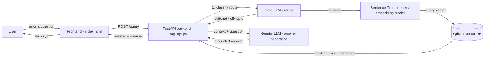

# Per Ankh — Egyptian History RAG

A Retrieval-Augmented Generation (RAG) system that answers questions about ancient Egyptian history using content chunked from history books. A FastAPI backend retrieves relevant book pages from a vector database and generates grounded answers with an LLM. A themed web frontend ("Per Ankh") lets users ask questions and see the retrieved source pages.

## Architecture



Two LLM providers are used for different jobs: **Groq** classifies each query as `retrieve`, `chitchat`, or `off-topic`, and (for chitchat) writes the small-talk reply. **Gemini** generates the final answer, grounded only in the retrieved book excerpts.

## Tech Stack

| Layer | Technology |
|---|---|
| Backend | Python, FastAPI, Uvicorn |
| Vector database | Qdrant |
| Embeddings | `intfloat/multilingual-e5-small` (Sentence-Transformers) |
| Routing / chitchat LLM | Groq (via LangChain) |
| Answer-generation LLM | Google Gemini (via LangChain) |
| Frontend | Static HTML/CSS/JS (no framework) |

## Project Structure

```
rag-project/
├── .gitignore
├── README.md
├── notebook/
│   └── rag.ipynb           # data prep, chunking, embedding, evaluation
└── project/
    ├── rag_api.py           # FastAPI backend
    ├── index.html            # frontend
    ├── requirements.txt
    ├── output.md              # chunked source data
    ├── .env                    # real secrets (not committed)
    └── .env.example              # template for required env vars
```

## Domain & Data

The knowledge base is built from Egyptian history books, split into page-level chunks. Each chunk stored in Qdrant carries the following payload:

- `book_name` — which source book the chunk came from
- `page_number` — the page it appears on
- `content` — the chunk text

Retrieval returns the `TOP_K` most similar chunks by embedding similarity, which are passed to the LLM as context so answers are grounded in the actual book text rather than the model's general knowledge.

## Backend Setup

1. Clone the repo and move into the project folder:
   ```bash
   git clone https://github.com/mayahazem/rag-project.git
   cd rag-project/project
   ```
2. Create a virtual environment and install dependencies:
   ```bash
   python -m venv venv
   venv\Scripts\activate        # Windows
   # source venv/bin/activate   # macOS/Linux
   pip install -r requirements.txt
   ```
3. Copy the environment template and fill in real values:
   ```bash
   copy .env.example .env        # Windows
   # cp .env.example .env        # macOS/Linux
   ```
4. Run the API:
   ```bash
   uvicorn rag_api:app --reload --port 8000
   ```
5. Confirm it's running by visiting `http://127.0.0.1:8000/health` — should return `{"status": "ok"}`.

## Frontend Setup

The frontend is a single static `index.html` file with no build step.

1. Open `project/index.html` directly in a browser (double-click it, or use a simple static server).
2. In the top bar, confirm the API URL field points to your running backend (default: `http://127.0.0.1:8000`).
3. Click **Ping the temple** to verify the backend is reachable.
4. Type a question and click **Consult the Archive** (or press `Ctrl + Enter`).

## Environment Variables

Defined in `.env` (see `.env.example` for the template):

| Variable | Description |
|---|---|
| `QDRANT_URL` | URL of your Qdrant instance |
| `QDRANT_API_KEY` | API key for Qdrant |
| `QDRANT_COLLECTION` | Name of the Qdrant collection holding the book chunks |
| `EMBEDDING_MODEL` | Embedding model name (defaults to `intfloat/multilingual-e5-small`) |
| `GEMINI_MODEL` | Gemini model name used for answer generation |
| `GEMINI_API_KEY` | API key for Gemini |
| `GROQ_MODEL` | Groq model name used for routing and chitchat |
| `GROQ_API_KEY` | API key for Groq |
| `TOP_K` | Number of chunks retrieved per query (e.g. `3`) |

## API Reference

### `GET /health`
Returns API status.

### `POST /query`
Classifies the query, retrieves relevant book pages (if applicable), and returns a grounded answer.

**Request body:**
```json
{
  "query": "Who is Khufu?"
}
```

**Response:**
```json
{
  "query": "Who is Khufu?",
  "route": "retrieve",
  "answer": "Based on the provided books, Khufu is described as...",
  "sources": [
    { "book_name": "Book 2.The Old Kingdom", "page_number": 196, "score": 0.84 }
  ]
}
```

**curl example:**
```bash
curl -X POST http://127.0.0.1:8000/query \
  -H "Content-Type: application/json" \
  -d '{"query": "Who is Khufu?"}'
```

## Evaluation Results

Retrieval quality was measured with precision and recall at `top_k = 3` across a small set of test queries with known relevant pages:

| Query | Expected pages | Retrieved pages | Precision | Recall |
|---|---|---|---|---|
| Who are the Hyksos? | {112, 113} | {112, 100, 63} | 0.33 | 0.50 |
| Where is the Keftyew? | {100, 101, 102} | {112, 106, 100} | 0.33 | 0.33 |
| Who won the war of Ramses II? | {601} | {601, 595, 589} | 0.33 | 1.00 |

**Average precision: 0.33**
**Average recall: 0.61**

These results suggest the retriever reliably surfaces at least one relevant page per query (driving recall), but often pads results with adjacent, less-relevant pages at `top_k = 3` (limiting precision).

## Screenshots

**Frontend — asking a question and viewing the grounded answer with sources:**


**Backend running locally:**


